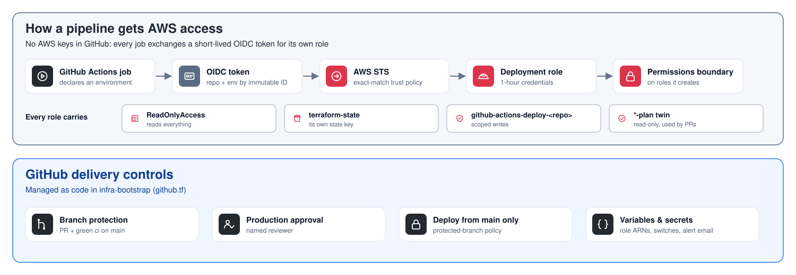

# infra-bootstrap

> Part of **[Java Platform](https://github.com/maga-zargaryan/java-platform)** · [java-app](https://github.com/maga-zargaryan/java-app) (source) · **infra-bootstrap** → [platform-infra](https://github.com/maga-zargaryan/platform-infra) → [java-ami](https://github.com/maga-zargaryan/java-ami) → [java-infra](https://github.com/maga-zargaryan/java-infra)
>
> See [java-platform](https://github.com/maga-zargaryan/java-platform) for how the four layers fit together.

Long-lived account foundation for the Java platform. Applied **locally by an
administrator**, because it creates the roles every other pipeline uses. Nothing
here is torn down when environments are destroyed.

```text
infra-bootstrap ─► platform-infra ─► java-ami ─► java-infra
```

## Diagrams

### How CI gets AWS access

<picture>
  <source media="(prefers-color-scheme: dark)" srcset="docs/diagrams/identity.dark.svg">
  
</picture>

Every job exchanges a short-lived GitHub OIDC token for its own role; GitHub delivery controls are managed as code.

Diagrams are generated by [`tools/diagrams`](https://github.com/maga-zargaryan/java-platform/tree/main/tools/diagrams) in the java-platform repository.

## What it manages

| Area | Resources |
|---|---|
| Terraform state | S3 bucket (versioned, SSE, TLS-only, `prevent_destroy`), native S3 locking |
| Release artifacts | `java-platform-artifacts-<account>-<region>`, versioned JARs under `java-app/<version>/` |
| Plan store | `tfplans-<account>-<region>`: reviewed production plans between the plan and apply jobs; only the prod plan/apply roles can touch them; deleted after apply, expired after 1 day |
| CI identity | GitHub OIDC provider, one role per repository × GitHub Environment |
| Guardrails | `java-platform-permissions-boundary`, required on every IAM role a pipeline creates |
| Account baseline | EBS encryption by default, S3 account public access block, IAM Access Analyzer, multi-region CloudTrail (customer-managed KMS key optional via `cloudtrail_kms_enabled`) |
| DNS | Public hosted zone, **always imported, never created** (`prevent_destroy`) |
| Cost | Monthly budget with email alerts (imported) |
| GitHub | Environments, required reviewers, `AWS_ROLE_ARN`/`AWS_REGION` variables, `ALERT_EMAIL` secret, `PRODUCTION_ENABLED` and `TF_PLAN_BUCKET` variables, `main` branch protection |

Values other repositories need are published to SSM Parameter Store under `/java-platform/`.

## CI roles

| Repository | Environment | Role | Access |
|---|---|---|---|
| platform-infra | `development` / `production` / `shared` | `github-actions-platform_{dev,prod,shared}` | apply |
| platform-infra | `*-plan` | `github-actions-platform_*_plan` | read-only |
| java-ami | `shared` / `shared-plan` | `github-actions-ami[_plan]` | apply / read-only |
| java-infra | `development` / `production` | `github-actions-workload_{dev,prod}` | apply |
| java-infra | `*-plan` | `github-actions-workload_*_plan` | read-only |
| java-app | `release` (tags `v*` only) | `github-actions-app_release` | write new releases under `java-app/*` only |

- Trust is pinned to the immutable owner and repository IDs and the GitHub Environment (`StringEquals`).
- Plan roles: `ReadOnlyAccess` + read of their own state + lock file.
- Apply roles: `ReadOnlyAccess` + a per-repository write policy (`github-actions-deploy-*`).
  They can only create IAM roles under their own name prefix and only with the permissions boundary attached.
- Apply environments accept deployments from `main` only; `production` requires approval.

## Apply

```bash
export GITHUB_TOKEN=$(gh auth token)
cd terraform
terraform init
terraform plan  -var-file=../config/bootstrap.tfvars -out=tfplan
terraform apply tfplan
```

`config/bootstrap.tfvars` is not committed (it holds the alert email); start from
`config/bootstrap.tfvars.example`. A repository must have a `main` branch before it
is added to `protected_repositories`.

### First-time bootstrap in a new account

1. Comment out `backend.tf`, apply with local state to create the state bucket.
2. Restore `backend.tf` and run `terraform init -migrate-state`.

## Single account

Everything runs in one AWS account, isolated by VPC, KMS key, IAM role and state
file per environment. The full Well-Architected setup is one account per
environment under AWS Organizations; the code is account-agnostic so that move
only changes configuration.

## Release GitHub App (one-time, in the browser)

Cross-repository pull requests (java-app → java-ami → java-infra, and the prod promotion) are opened by a
GitHub App, because the built-in workflow token cannot write to other repositories and its pull requests
do not trigger checks.

1. GitHub → Settings → Developer settings → GitHub Apps → **New GitHub App**: name `java-platform-release`,
   no webhook, repository permissions **Contents: read & write**, **Pull requests: read & write**.
2. Install it on `java-ami` and `java-infra` (and `java-app`).
3. Generate a private key, then store it as a secret in the three repositories:
   ```bash
   for r in java-app java-ami java-infra; do gh secret set RELEASE_APP_PRIVATE_KEY -R maga-zargaryan/$r < key.pem; done
   ```
4. Set `release_app_id` in `config/bootstrap.tfvars` and apply: bootstrap publishes `RELEASE_APP_ID` to the
   three repositories. The private key stays out of Terraform state.
